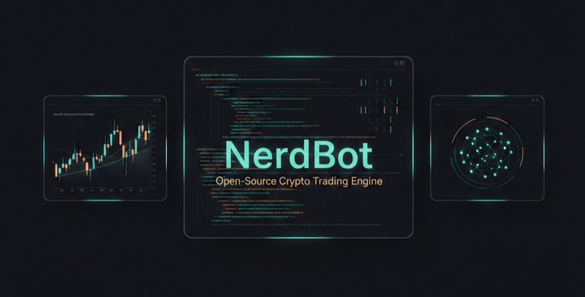

<p align="center">
  
</p>

<h1 align="center">Nerdbot</h1>
<p align="center"><strong>Open-source crypto trading engine built on Freqtrade</strong></p>

---

## Overview

**Nerdbot** is a customized, free, and open-source crypto trading bot built on top of the
excellent [Freqtrade](https://github.com/freqtrade/freqtrade) engine.

It preserves full compatibility with Freqtrade while providing a curated and opinionated
distribution focused on:

- reliability and operational stability  
- modular strategy development  
- automation via CLI, WebUI, and Telegram  
- extensibility for future integrations (web platforms, messaging, automation pipelines)

Nerdbot is written in **Python 3.11+** and runs on Linux, macOS, and Windows.

---

## Upstream Status

Nerdbot is powered by the Freqtrade engine and follows its upstream development closely.

Upstream project health:

[](https://github.com/freqtrade/freqtrade/actions/workflows/ci.yml)
[](https://doi.org/10.21105/joss.04864)
[](https://coveralls.io/github/freqtrade/freqtrade?branch=develop)
[](https://www.freqtrade.io)

For complete documentation of the underlying engine, see:  
👉 https://www.freqtrade.io

---

## Disclaimer ⚠️

This software is provided **for educational and research purposes only**.

Trading cryptocurrencies involves substantial risk.  
Do **not** trade with money you cannot afford to lose.

- Always start in **Dry-Run mode**
- Fully understand your strategy before deploying capital
- The authors and contributors assume **no responsibility** for trading outcomes

---

## Supported Exchanges

Nerdbot supports all exchanges available through Freqtrade and CCXT.

### Spot Exchanges

- Binance  
- BingX  
- Bitget  
- Bitmart  
- Bybit  
- Gate.io  
- HTX  
- Hyperliquid (DEX)  
- Kraken  
- OKX / MyOKX (EEA)  
- Community-tested: Bitvavo, KuCoin  
- Many others via [CCXT](https://github.com/ccxt/ccxt) (not guaranteed)

### Futures Exchanges (Experimental)

- Binance  
- Bitget  
- Gate.io  
- Hyperliquid  
- OKX  
- Bybit  

📖 Please read:
- [Exchange-specific notes](docs/exchanges.md)  
- [Trading with leverage](docs/leverage.md)

before trading.

---

## Features

- **Python 3.11+**
- Dry-run trading (no capital risk)
- Backtesting and historical simulation
- Strategy optimization via machine learning (FreqAI)
- Adaptive market prediction models
- Whitelist / blacklist pair management
- Built-in WebUI
- Telegram control and monitoring
- Profit and loss reporting in fiat
- Persistent storage (SQLite)

---

## Installation & Quick Start

Nerdbot follows the same installation process as Freqtrade.

📦 **Recommended:** Docker  
📖 Documentation:
- Docker quickstart  
  https://www.freqtrade.io/en/stable/docker_quickstart/
- Native installation  
  https://www.freqtrade.io/en/stable/installation/

---

## Basic Usage

Nerdbot can be invoked using either command:

```bash
nerdbot
freqtrade
